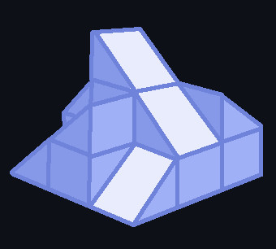

I've had an idea for a while to create a sculpture with a number of cubes cut along a diagonal to form 45-degree angle mirrors. These would stack in a grid atop other cubes at different heights facing one of the four directions. The idea is to create four images to place along the sides of the sculpture so that their reflection directly above the sculpture forms some fifth image. This repository is made with the intention of organizing this idea and visualizing what the reflectinos of various sculptures might look like.

  

